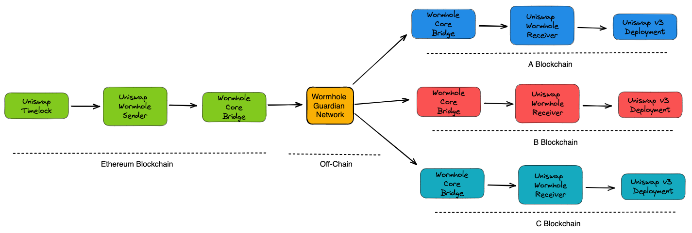

# Uniswap-Wormhole-Bridge

This repository defines the Uniswap Wormhole Sender and Uniswap Wormhole Receiver smart contracts that are leveraged by the Uniswap Timelock contract to perform governance on Uniswap V3 Deployments on remote blockchains.

## Basic Architecture

The following defines the basic architecture by which the Uniswap Wormhole Sender and Uniswap Wormhole Receiver smart contracts are utilized.

The intent here is to provide an effective transport layer by which the Uniswap Timelock contract can conduct governance on Uniswap V3 deployments on remote blockchains via Wormhole.

## Uniswap Wormhole Sender

The Uniswap Wormhole Sender contract is designed to be deployed on Ethereum by which the Uniswap timelock contract can enact governance actions on EVM-based deployments outside Ethereum.

This contract is a single contract, which can then send messages to one or more remote deployments.  The Uniswap Wormhole Sender contract must give the owner rights to the Uniswap Timelock contract for this message sending to be effective.

## Uniswap Wormhole Receiver

The Uniswap Wormhole Receiver contract is designed to be deployed on remote EVM-based Uniswap V3 deployments and should only accept messages, which are initiated from the sender and are destined for the deployed blockchain they are on.

This contract should also invalidate the Wormhole VAAs past a predefined validity window and additionally enforce sequencing such that sequency numbers are only ever monotonically increasing to be valid.  So if there are two valid VAAs (3 and 4), if 4 is consumed first, 3 will no longer be valid.

## Deployment

If a sender contract is already deployed, you should not need to deploy a new one, you can re-use the sender contract to send governance messages to multiple remote deployments.  If the sender is not yet deployed, you need deploy it on chain, and then call setOwner with the Uniswap Timelock contract to transfer ownership to Uniswap Governance.

During the initial deployment, you will need to additionally provide the Wormhole Core Bridge contract address from Ethereum as an argument.  The Wormhole Core Bridge contract address information can be found [here](https://book.wormhole.com/reference/contracts.html).

If you are deploying the receiver to a new chain, you will want to make a copy of the receiver contract and modify the constant name and value to match the chain you plan to deploy on.  Additionally, at construction time, you will need to supply both the Wormhole Core Bridge contract address for the chain you are deploying on and the current contract address for the sender you want to trust.

If you are redeploying the receiver to an existing chain, you will want to deploy the latest copy of the receiver contract for that chain with any changes desired.  Similarly, the contruction addresses for the Wormhole Core Contracts and sender will need to be supplied.  You will additionally need to use the current receiver implementation to send a governance message to the Uniswap V3 deployment on that chain to update it's trusted receiver to point to the new implementation.